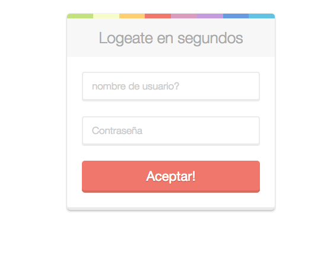
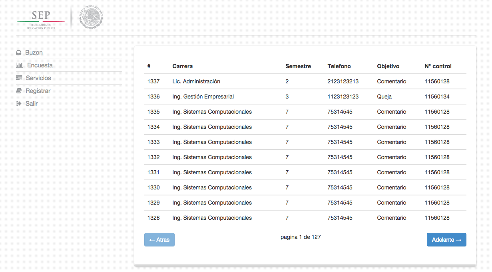
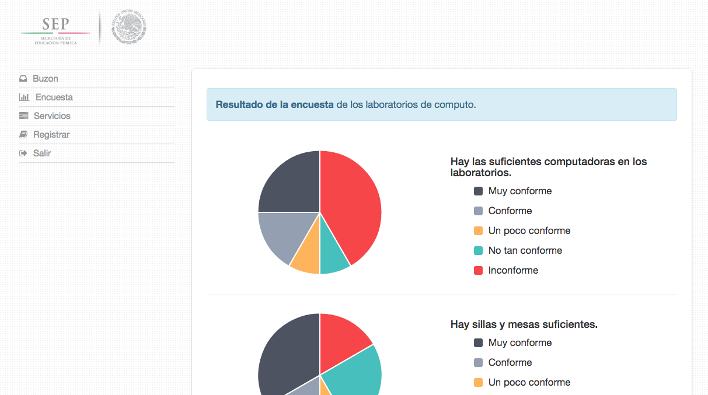
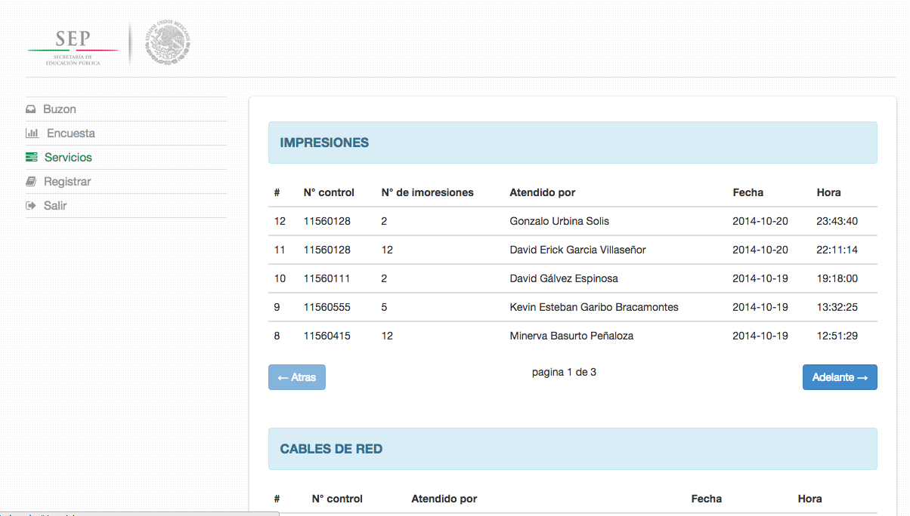
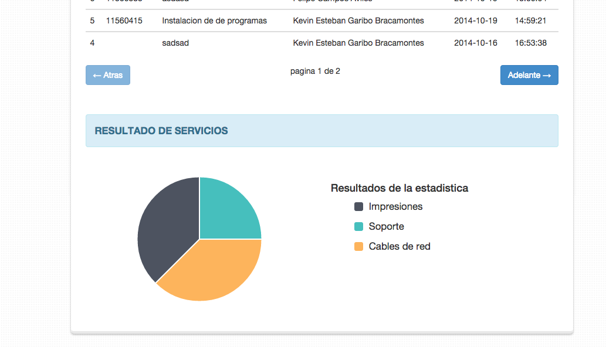
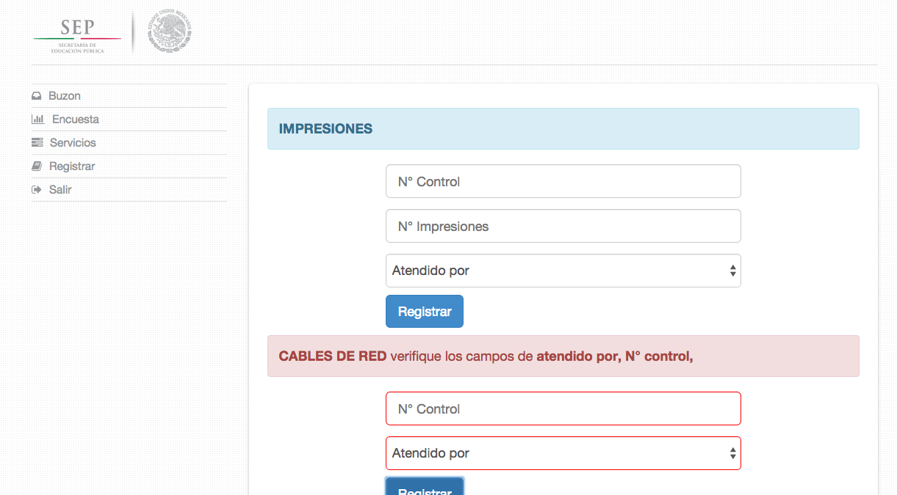
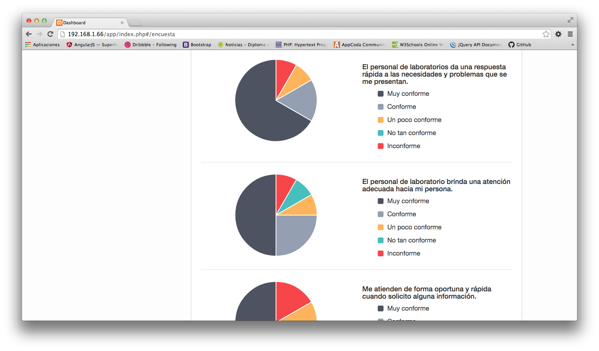

Dashboard para laboratorios de computo
======================================
Dashboard para administrar y ver los resultados de diferentes servicios de **[Servicios del laboratorio](https://github.com/garibo/Servicios)**.
La apliacion se encarga de tomar los datos del buzon de quejas y mostrarlos al administrador, se encarga de graficar los resultados de las encuestas y registrar servicios como prestamo de objetos a usuarios del laboratio de computo.
Esta aplicacion esta construida usando los frameworks y librerias:
- [AngularJS](https://angularjs.org/) 
- [Bootstrap](http://getbootstrap.com/)
- [JQuery](http://jquery.com/)

Ademas usa PHP como lenguaje de Backend y consta de los modulos de:
- Buzon
- Encuesta
- Servicios
- Registro

